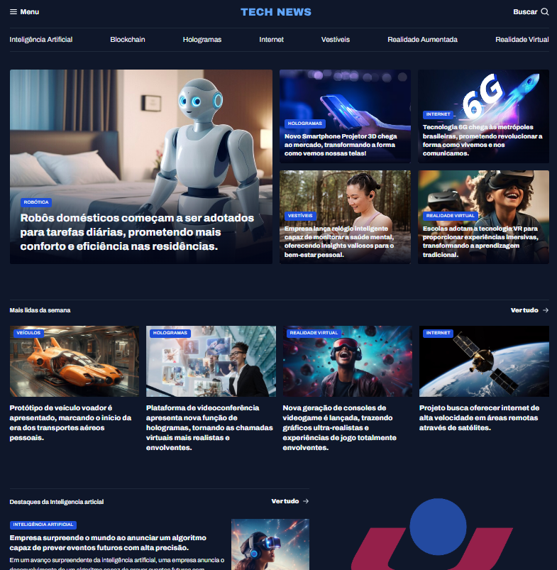

# 🌐 Tech News

**Tech News** é um portal de notícias voltado para tecnologia, trazendo as principais tendências e inovações em áreas como **Inteligência Artificial, Blockchain, Hologramas, Internet, Vestíveis, Realidade Aumentada e Realidade Virtual**.  

O objetivo da página é apresentar notícias de forma clara, organizada e visualmente atraente, destacando os assuntos mais relevantes do mundo tech.

# 📸 Preview


---

## 📸 Layout

A página inicial é dividida em seções:

- **Menu superior**: Navegação pelas categorias de tecnologia.
- **Destaque principal**: Notícia em evidência (ex.: robôs domésticos).
- **Cards de notícias**: Notícias por categoria, com título e imagem de destaque.
- **Mais lidas da semana**: Lista das notícias com maior engajamento.
- **Destaques de Inteligência Artificial**: Espaço para novidades específicas dessa área.

---

## 🛠️ Tecnologias utilizadas

- **HTML5**: Estrutura da página.  
- **CSS3**: Estilização e organização do layout.  
- **Possível integração futura** com **JavaScript** para tornar os cards interativos.  

---

## 🚀 Funcionalidades

- Interface responsiva para melhor experiência em diferentes dispositivos.  
- Organização em seções temáticas para facilitar a navegação.  
- Destaques visuais para notícias mais importantes.  

---

## 📂 Estrutura do projeto

```bash
📁 tech-news/
│-- 📄 index.html      # Página principal
│-- 📄 style.css       # Estilos da página
│-- 📁 assets/         # Imagens, ícones e arquivos de mídia
│-- 📄 README.md       # Documentação do projeto
